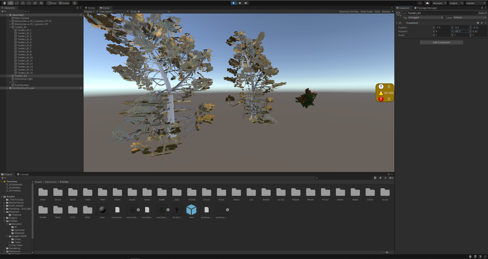

# Ajout de plantes depuis REALnatPremium

## Génération de la plante
 1. Une fois les paramètres choisis dans la partie "Create" de l'onglet "Modeler", appuyer sur "Go
 2. Dans "Real-time template", appuyer sur "Create LODs"
 3. (Optionnel) Appuyer sur "Save" pour sauvegarder la plante dans "Pool"
 4. Cliquer sur export puis sélectionner le format .obj, .mtl dans la fenêtre de gestionnaire de fichiers et cliquer sur enregistrer
 5. Sélectionner le format d'image png et les options "RGBA (Alpha Channel)" et "Save LODs separately" et "Save maps separately" 

## Importation dans Unity
1. Importer depuis le gestionnaires de fichier, les fichier .obj, .mtl et .png de l'objet 3D (Il y a un .png par face de l'imposteur)
Dans Unity :
2. Sélectionner tous les fichiers .png, et cocher la case "Alpha is transparence"
3. A partir de l'objet 3D : 
  1. Sélectionner les matériaux qui le composent
  2. Faites un clic droit sur les matériaux et cliquer sur "Extract from Prefab"
4. Dans l'inspecteur des matériaux obtenus :
  1. Modifier la valeur de "Render face" par "Both"
  2. Cocher la case de "Alpha clipping"

Exemple de rendu :

