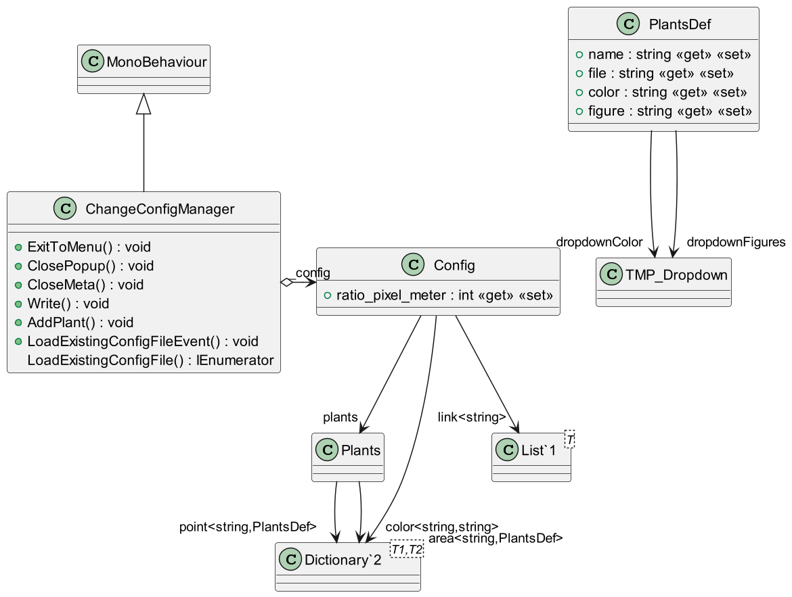

# ChangeConfigManager

Gabriel Masson
***

# Documentation

# Fonctions

### _void_ DeserializeConfig(string json)

#### Désérialise le fichier json et l'assigne en tant que nouvelle configuration

<blockquote>

_paramètres_ :\
&emsp; json : Chemin d'accès du fichier de configuration en `json`

</blockquote>

&nbsp;

### _void_ InitPageArea()

#### Initialise le menu pour les plantes simple

<blockquote>

A exécuter **seulement** après l'analyse du fichier `json`

</blockquote>

&nbsp;

### _void_ InitPagePoint()

#### Initialise le menu pour les surfaces

<blockquote>

A exécuter **seulement** après l'analyse du fichier `json`

</blockquote>

&nbsp;

### _bool_ UpdateDropDownOptions()

#### Permet de savoir si il existe un duo de forme et couleur assigné à deux plantes différentes

<blockquote>

_returns_ :\
&emsp; bool : `true` si il existe un duo, `false`sinon

</blockquote>

&nbsp;

### _void_ ChangePlantMetaDatas(string key, bool area, TextMeshProUGUI btn)

#### Permet la modification d'une plante à partir d'un panel

<blockquote>

_paramètres_ :\
&emsp; key : clef de la plante d'un dictionnaire plant ou area (`Dictionary<string, PlantsDef>`)\
&emsp; area : `true` si la plante est une surface, sinon `false`\
&emsp; btn : le GameObject text du bouton qui permet la modification des paramètres

</blockquote>

&nbsp;

### _void_ AddPlant()

#### Permet d'ajouter une nouvelle plante à la configuration

&nbsp;

### _void_ Write()

#### Permet de sauvegarder la configuration

&nbsp;

### _void_ CloseMeta()

#### Permet de fermer le panel de modification de plantes

&nbsp;

### _void_ ClosePopup()

#### Permet de fermer le panel d'erreur