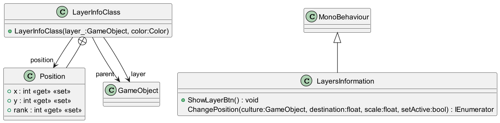

# LayerInformation

Gabriel Masson

---

# Documentation

# Fonctions

### _IEnumerator_ ChangePosition(GameObject culture, float destination, float scale, bool setActive)

#### Permet de changer la position d'un layer

<blockquote>

_paramètres_ :\
&emsp; culture : Le gameObject d'un layer\
&emsp; destination : position en y d'un layer\
&emsp; scale : la taille cible du layer\
&emsp; setActive : `true` si le layer doit apparaître, `false` sinon

</blockquote>

&nbsp;
