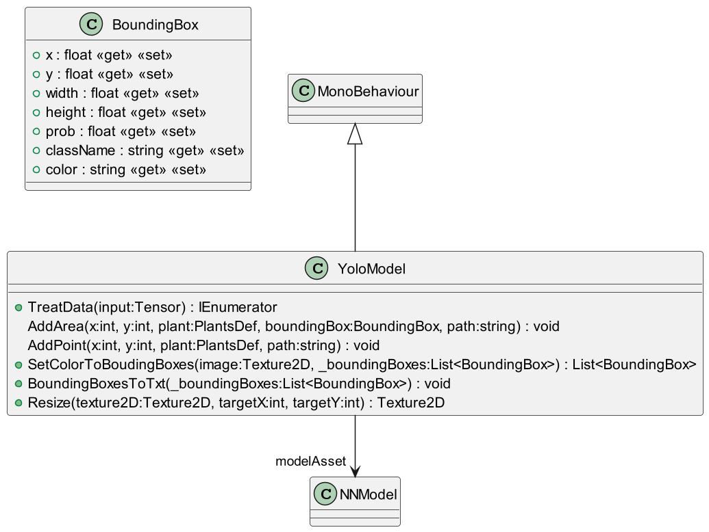

# YoloModel

Gabriel Masson
***

# Documentation

# Fonctions

### _IEnumerator_ TreatData(Tensor input)

#### Fonction principale d'analyse d'une image

<blockquote>

_paramètres_ :\
&emsp; input : Tensor comportant les 3 channel d'une image (R, G, B)

</blockquote>

&nbsp;

### _Texture2D_ Resize(Texture2D texture2D, int targetX, int targetY)

#### Renvoie l'image recadrée

<blockquote>

_paramètres_ :\
&emsp; texture2D : image qui doit être recadrée\
&emsp; targetX : longueur de la nouvelle image\
&emsp; targetY : Hauteur de la nouvelle image

_returns_ :\
&emsp; Texture2D : image recadrée

</blockquote>

&nbsp;

### _void_ BoundingBoxesToTxt(List<BoundingBox> _boundingBoxes)

#### Converti les bouding boxes en fichier .txt

<blockquote>

_paramètres_ :\
&emsp; _boundingBoxes : Liste qui contient les boudingBoxes analysées de l'image

</blockquote>

&nbsp;

### _List<BoundingBox<aa>>_ SetColorToBoudingBoxes(Texture2D image, List<BoundingBox<aa>> _boundingBoxes)

#### Assigne la couleurs aux boundingBoxes

<blockquote>

_paramètres_ :\
&emsp; image : image à analyser\
&emsp; _boundingBoxes : Liste qui contient les boudingBoxes analysées de l'image

</blockquote>

&nbsp;

### _void_ AddArea(int x, int y, PlantsDef plant, BoundingBox boundingBox, string path)

#### Converti une boudingBoxes d'une surface en données dans un fichier .txt

<blockquote>

_paramètres_ :\
&emsp; x : position x de la plante\
&emsp; y : position y de la plante\
&emsp; plant : la classe qui correspond à la plante analysée\
&emsp; boundingBox : la boundingBox qu'on veut convertir
&emsp; path : le chemin d'accès où le fichier .txt devra être 

</blockquote>

&nbsp;

### _void_ AddPoint(int x, int y, PlantsDef plant, string path)

#### Converti une boudingBoxes d'une plante simple en données dans un fichier .txt

<blockquote>

_paramètres_ :\
&emsp; x : position x de la plante\
&emsp; y : position y de la plante\
&emsp; plant : la classe qui correspond à la plante analysée\
&emsp; path : le chemin d'accès où le fichier .txt devra être

</blockquote>

&nbsp;
