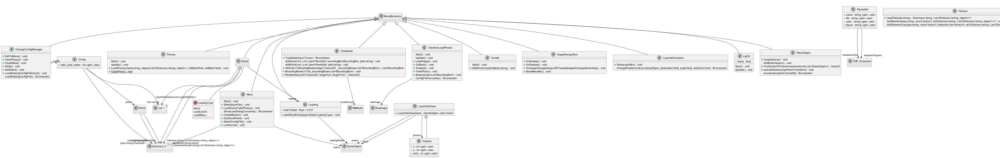

# Step3_Visualisation

***

 # Général PlantUML

---

> # Documentation
>
>>## [YoloModel](Markdowns/YoloModel.md)
>
>>## [ChangeConfigManager](Markdowns/ChangeConfigManager.md)
>
>>## [LayerInformation](Markdowns/LayerInformation.md)